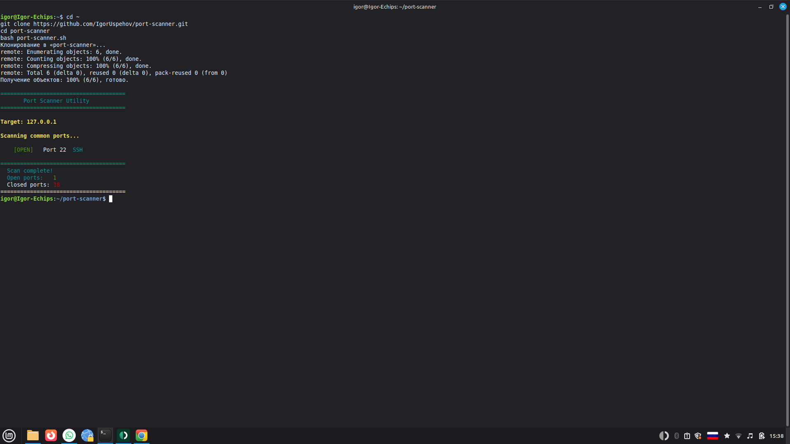

# Port Scanner Utility

A simple Bash script to scan open ports on any host in your network.

## Result



## What it does

- Scans common ports (default mode)
- Scans ports 1-1024 (full mode)
- Scans custom ports (comma-separated)
- Shows service name for known ports (SSH, HTTP, MySQL, etc.)
- Shows total open/closed count

## Usage

```bash
git clone https://github.com/IgorUspehov/port-scanner.git
cd port-scanner
chmod +x port-scanner.sh
```

Scan common ports on localhost:
```bash
bash port-scanner.sh
```

Scan specific host:
```bash
bash port-scanner.sh 192.168.1.1
```

Scan ports 1-1024:
```bash
bash port-scanner.sh 192.168.1.1 full
```

Scan custom ports:
```bash
bash port-scanner.sh 192.168.1.1 80,443,8080,3306
```

## Desktop shortcut (Linux Mint / Ubuntu)

```bash
cat > ~/Desktop/Port-Scanner.desktop << 'EOF'
[Desktop Entry]
Version=1.0
Type=Application
Name=Port Scanner
Comment=Scan open ports on network hosts
Exec=bash -c 'read -p "Enter host (default 127.0.0.1): " h; bash "/home/igor/port-scanner/port-scanner.sh" ${h:-127.0.0.1}; echo ""; echo "Press Enter to close..."; read'
Terminal=true
Icon=network-workgroup
Categories=Network;Utility;
EOF
chmod +x ~/Desktop/Port-Scanner.desktop
```

## Requirements

- Debian / Ubuntu / Linux Mint
- No root required
- No additional tools needed (uses built-in bash /dev/tcp)

## Tested on

- Linux Mint 21.3

## Compatible with

- Debian 11+
- Ubuntu 20.04+
- Linux Mint 20+

## Author

Ihor Kriazhev — [github.com/IgorUspehov](https://github.com/IgorUspehov)
AI-assisted automation | Linux | Android | Python
